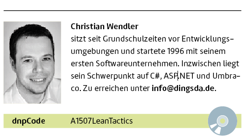

# Richtlinien Redaktion dotnetpro 
Stand September 2015

#### Grundsätzlich gilt die neue deutsche Rechtschreibung laut aktuellem Duden. 

### Autorenkasten

Der Autorenkasten hat links ein Bild und rechts eine Kurzbiographie. Die erste Zeile ist gefettet und trägt nur den Namen des Autors. Ist die Kurzbio kürzer als das Bild daneben Platz braucht, bleiben die Zeilen vor dem Balken leer. Alle Adressen (E-Mail, Twitter, Facebook, Website …) werden gefettet. Allerdings sollten maximal drei enthalten sein. Will ein Autor keine Adresse veröffentlichen, ist das in Ordnung. Länger als das Bild darf die Kurzbio nicht sein.  Die Kurzbio endet mit einem Punkt, wenn der letzte Satz ein vollständiger Satz ist. 

Bei zwei oder maximal drei Autoren pro Artikel, kommen die Autorenkästen über- oder nebeneinander.

 

###Produktbezeichnungen

Produktbezeichnungen werden so übernommen, wie von den Herstellern gewünscht. Wenn Sie den Namen einer Produktkomponente zum ersten Mal verwenden, schreiben Sie nach Möglichkeit den Namen aus und setzen Sie das Komponentenkürzel in Klammern dahinter. 

~~~~~~
Microsoft Operations Manager (MOM)
~~~~~~

### Firmenbezeichnungen

Wenn auf ein Unternehmen Bezug genommen wird (z. B. Bitkom, DATEV, TOP TECHNOLOGIES CONSULTING GmbH, conplement AG), wird die korrekte Schreibweise für diese Firma verwendet, und zwar bei jeder Verwendung des Firmennamens.

### Versal und gemischt

* Es gilt die jeweilige Produktschreibweise. 
* Was als Buchstabenfolge gesprochen wird, muss versal geschrieben werden, zum Beispiel "BASF".
* Wenn ein gebräuchlicher technischer Begriff als Wort ausgesprochen wird, schreibt er sich bei einer Länge von drei oder mehr Zeichen gemischt, zum Beispiel "Bios", "Via", "Ansi".
* Akronyme und Abkürzungen, die schon längere Zeit etabliert sind, werden als normale Wörter geschrieben. Zum Beispiel: "NATO" zu "Nato", "LKW" zu "Lkw", "RADAR" zu "Radar", "KFZ" zu "Kfz", "AIDS" zu "Aids".
* Werden die Erweiterungen von Dateien genannt, wird der Punkt, der die Erweiterung vom Dateinamen trennt, nicht mit angegeben. Bei Zusammensetzungen ist die Erweiterung nicht kursiv zu schreiben: Gerade, versal: DOC-Dateien, JPG-Dateien

### Abkürzungen und Akronyme
Häufig werden Auflösungen von Abkürzungen in ein Kompositum eingebaut. Bitte umgehen Sie solche Konstruktionen.

~~~~~~
OLAP-System (OLAP = Online Analytical Processing).
~~~~~~

Wenn eine Abkürzung zum ersten Mal verwendet wird, schreiben Sie den Ausdruck aus und setzen Sie die Abkürzung in Klammern dahinter.

~~~~~~
Service Oriented Architecture (SOA)
~~~~~~

In der dotnetpro sind Standardabkürzungen wie "z. B.", "etc.", "d. h." nur in Tabellen erlaubt! Sonst bitte ausschreiben (zum Beispiel, et cetera, das heißt ...)

### Literaturhinweise

Literaturhinweise werden im Text entweder so notiert [1]. Bezieht sich eine Stelle im Fließtext auf mehrere Referenzen, dann wird das entweder so [1][2] oder auch wie so notiert: Wie in [1], [2] oder [3] zu lesen ...

[1] Die vollständige bibliografische Angabe mit der zugehörigen Sigle findet sich am Ende des Artikels.
Referenzen, Literaturangaben
Alle Angaben werden mit Kommata getrennt. 

#### Bei Büchern

[Verweis] Autor (bis zu zwei in der Form Vorname, Nachname; ab drei Autoren: Vorname, Nachname der ersten Autors et al.), Titel, Verlag und Erscheinungsjahr, ISBN mit Trennstrichen

~~~~~~
[1] Janosh, O wie schön ist Panama, Hanser Buchhandelsverlag 2010, 
    ISBN 978-3-86680-192-9
~~~~~~

#### Bei Zeitschriftenartikeln

[Verweis] Autor (s. o.), Titel des Artikels, Name der Zeitschrift und Nummer/Jahr, Seitenzahl, Link

~~~~~~
[2] Neno Loje, Wie es dem Nutzer beliebt, 
    dotnetpro 6/2005, Seite 102 ff., 
    www.dotnetpro.de/A1203TFS
~~~~~~

Folgezeilen von Referenzen werden mit Einzügen am oberen Text ausgerichtet.

~~~~~~
[2] Neno Loje, Wie es dem Nutzer beliebt,
    dotnetpro 6/2005, Seite 102 ff., 
    www.dotnetpro.de/A1203TFS
~~~~~~

### Zahlen, Maßeinheiten und Währungen

* Zahlen zwischen eins und zwölf werden ausgeschrieben, größere Zahlen hingegen als Ziffern. 
* Es gibt keinen Punkt als Tausendertrennzeichen. 
* In Tabellen, Listen oder Rechnungen werden auch Zahlen, die kleiner sind als zwölf, als Ziffern geschrieben. 
* "Prozent" im Fließtext immer ausschreiben. 
* Zahlen, die zusammen mit einer abgekürzten Einheit stehen, werden in Ziffern geschrieben.

~~~~~~
drei PCs, zwölf Prozent, 20 Prozent, 5 GByte
Dagegen: zwei Gigabyte

Bitte beachten:
1000 Bit = 1 kBit
1024 KByte = 1 MByte
300 MByte

Aber: mehrere Megabyte
~~~~~~

* Großes "K" bei "KByte" (K entspricht dem Multiplikationsfaktor 1024)
* Kleines "k" bei "kHz" ("K" entspricht dem Multiplikationsfaktor 1000)
* Ein Gigahertz = 1 GHz
* Großes "M" für "Mega" (1 MByte = 1024 KByte, aber 1 Megawatt = 1 Million Watt)
* Kleines "m" für "Milli"; eine Millisekunde = 1 ms

Alle Maßeinheiten werden so geschrieben, wie sie gesprochen werden, in der Regel also nicht in Abkürzung. In Tabellen dagegen dürfen aus Platzgründen Abkürzungen verwendet werden.

### Kursivsetzung
Das allermeiste wird nicht kursiv gesetzt. 

#### Nicht kursiv gesetzt: 

* Urls
* Zitate (in Anführungszeichen)
* Der Name dotnetpro

#### Kursiv gesetzt werden nur:

* Zitate aus dem Code, 
* Methodennamen, 
* Klassennamen und 
* Zitate von der Bildschirmdarstellung insbesondere Menüpunkte oder Texte auf einem Screenshot beziehungsweise Bild
* Dateinamen und Pfadangaben
* Buch-, Zeitschriften-, Artikeltitel. Ausnahme: Auf den Newsseiten und im Autorenkasten werden diese nicht kursiv sondern in Anführungszeichen gesetzt. 

~~~~~~
Sie erhalten ein *DirectoryEntries*-Objekt immer nur über das Attribut *Children *eines *DirectoryEntry*-Objekts.

Wählen Sie den Menübefehl *Datei *| *Schließen*.

Klicken Sie auf *Abbrechen*. 

Die Datei *log.dat* enthält die Fehlermeldungen. 

Öffnen Sie die Datei *C:\Users\meier\Documents\kursiv.docx* und schreiben Sie dort *schwierig *hinein. 

Geben Sie hier *www.dotnetpro.de* ein. (Url kursiv, weil Bildschirmeingabe).
~~~~~~

### Hinweise zur Getrennt- und Zusammenschreibung

Grundsätzlich richtet sich die Getrennt- und Zusammenschreibung nach den Regeln der neuen Rechtschreibung. Begriffe, die sich aus zwei oder drei deutschen Wortteilen zusammensetzen, werden zusammengeschrieben. 

~~~~~~
Datenbankschnittstelle
~~~~~~

Ausnahmen machen wir bei besonders langen Begriffen. Dies ist natürlich Ermessenssache. Sobald ein Kompositum aus mehr als drei oder vier Wortteilen besteht, sollte an einer semantisch sinnvollen Stelle ein Bindestrich eingefügt werden. 

~~~~~~
Datenbankschnittstellen-Programmierung
~~~~~~

Weitere Ausnahme: Wenn ein Kompositum auf unterschiedliche Weise in unterschiedliche Bestandteile zerlegt werden kann und sich dadurch Bedeutungsunterschiede ergeben könnten, setzen Sie einen Bindestrich, der die Bedeutung verdeutlicht.

~~~~~~
Druck-Erzeugnis (nicht Druckerzeugnis, 
was als "Drucker-Zeugnis" interpretiert
werden könnte)
~~~~~~

### Komposita mit englischen Ausdrücken

Begriffe, die sich aus rein englischen Wörtern zusammensetzen, werden nicht gekoppelt, es sei denn, man schreibt sie auch im Englischen mit Bindestrich. Gleiches gilt für betriebswirtschaftliche Verfahren. 

~~~~~~
Stored Procedure, Customer Relationship Management, 
Supply Chain Management
Aber: der Check-in
~~~~~~

Begriffe, die sich aus englischen und deutschen Wortteilen zusammensetzen, werden mit einem Bindestrich gekoppelt.

~~~~~~
Datenbank-Interface
~~~~~~

Englische Begriffe, die zu deutschen Lehnwörtern geworden sind, behandeln wir als deutsche Wörter. 

Auch hier gibt es natürlich einen Ermessensspielraum. Sobald ein Begriff im Rechtschreibduden enthalten ist, wird er wie ein deutsches Wort behandelt. 

~~~~~~
Softwareentwicklung (aber: Batch-Mappe)

Server, Internet, Web, Browser, Performance

Somit ergibt sich: Applikationsserver, Webbrowser
~~~~~~

Ergeben sich Kopplungen aus drei oder gar mehr Wortteilen, von denen zwei aus dem Englischen kommen, koppeln wir diesen Begriff durch, auch wenn wir ohne den deutschen Begriff getrennt schreiben würden.

~~~~~~
Single-Sign-On-Technologie (nicht: Single Sign-On-Technologie), 
Customer-Relationship-Management-Lösung, 
Visual-Basic-Programmierung
~~~~~~

Schreiben Sie Komposita aus einem englischen Substantiv und einem deutschen Adjektiv zusammen und klein, wenn das englische Substantiv schon mit der korrekten Bedeutung im aktuellen Rechtschreibduden enthalten ist. Schreiben Sie das Kompositum mit einem Bindestrich, wenn das englische Substantiv noch nicht mit der korrekten Bedeutung im aktuellen Rechtschreibduden enthalten ist. Schreiben Sie in diesem Fall das englische Substantiv groß.

~~~~~~
computergestützt
Nicht: Computer-gestützt, computer-gestützt
Aber: View-geführt
Nicht: viewgeführt
~~~~~~

### Genitiv-Bildung

Hier gilt das Gleiche wie bei deutschen Lehnwörtern: Hat es ein Begriff in die deutsche Sprache geschafft, wird es mit Genitiv-s dekliniert. Dies gilt auch für Produkte.

~~~~~~
des Computers, des Decoders
~~~~~~

### Verweise auf Tabellen, Abbildungen und Grafiken

Auf Abbildungen et cetera wird im Fließtext verwiesen, z. B. (siehe Bild 3). Niemals sollten Formulierungen wie "die folgende Abbildung zeigt" oder "die oben stehende Tabelle verdeutlicht" vorkommen, denn es kann im Layout zu Verschiebungen der Abbildungen kommen. Stattdessen wird auf die Abbildungsnummerierung verwiesen.

~~~~~~
"Bild 3 zeigt" oder "Tabelle 1 verdeutlicht"
~~~~~~

### Aufzählungen

Es gibt verschiedene Möglichkeiten für Aufzählungen:

* Jeder Aufzählungspunkt ist ein vollständiger Satz: Das erste Wort wird großgeschrieben, am Ende steht ein Punkt.
* Der Aufzählungspunkt ist ein einzelner Begriff oder Teilsatz: Das erste Wort wird je nach Wortart groß oder klein geschrieben, am Schluss steht kein Satzzeichen. 

Der einleitende Satz vor der Aufzählung wird niemals nach der Aufzählung weitergeführt.

### Rotfärbung

Verweise auf Listings, Bilder, Tabellen und Kästen werden im Fließtext mit roter Farbe hervorgehoben. Für diese Hinweise gibt es in der Formatvorlage ein vordefiniertes Zeichenformat.

 **Beispiel**
Wie das geht, ist in <rot>Listing 2</rot> zu sehen.

Die umgebenden Klammern werden ebenfalls rotgefärbt. 

 **Beispiel**
Wie das geht, zeigt die Zeile 23 (Listing 2). 

Es sei denn, der Ausdruck in den Klammern ist erweitert: 

 **Beispiel**
Wie das geht, zeigt die Zeile 23 (siehe Listing 2). 

 **Beispiel**
Wie das geht, steht im Kasten Worauf es bei der Rotfärbung ankommt, der auch darauf eingeht, wie es ohne rote Farbe ist.  

 **Beispiel** 
Wie Sie richtig rotfärben (Bild 3). Sehen Sie hierzu auch Bild 4.

### Konventionen

Bitte beachten Sie: 

* der Url
* das Framework
* der Desktop
* das API
* das .NET Framework
* Visual Basic .NET 
* VB.NET
* ASP.NET
* COM (COM-Komponenten) 
* Skript schreibt sich mit k, außer JavaScript

Webadressen werden in keiner Weise ausgezeichnet (vor allem nicht kursiv gesetzt!) und werden grundsätzlich ohne "http://" angegeben, es sei denn, die Adresse enthält kein www.

Gehen Online-Adressen über das Zeilenende hinaus, ist beim Kürzen und Längen darauf zu achten, dass das Trennprogramm keinen Trennstrich macht. Erreicht werden kann das dadurch, dass an geeigneter Stelle (wo der Zeilenumbruch erfolgen soll) ein Leerschritt eingegeben wird.

### Tastenkombinationen

Tastenkombinationen sind in eckige Klammern zu setzen und gerade zu schreiben. 

~~~~~~
Jede Programmzeile wird mit [Return] abgeschlossen.
~~~~~~

Tastenkombinationen mit gleichzeitig gedrückten Tasten sind folgendermaßen zu schreiben: 

~~~~~~
[Alt]+[D]
~~~~~~

### Telefon- und Faxnummern

Telefon- und Faxnummern werden durch Leerzeichen getrennt, und zwar von der letzten Ziffer ausgehend in Zweiergruppen. Eine Gruppe von drei Ziffern wird nicht mehr gegliedert. Die Durchwahl wird ohne Bindestrich angeschlossen. Die Vorwahl steht in Klammern. 

Bei Auslandsvorwahlen werden mit "+" geschrieben. 

~~~~~~
(+49 231) 123 45 67.
~~~~~~

Bei gebührenpflichtigen Rufnummern 0180x und 0190x ist die erste Ziffer der Rufnummer (maßgebend für die Kosten pro Minute) ebenfalls in Klammern zu setzen.

~~~~~~
(018 05) 123 45 67.
~~~~~~

Bei kostenlosen Rufnummern steht die erste Ziffer dagegen nicht in der Klammer. 

~~~~~~
(08 00) 123 45 67 oder (01 30) 123 45 67.
~~~~~~